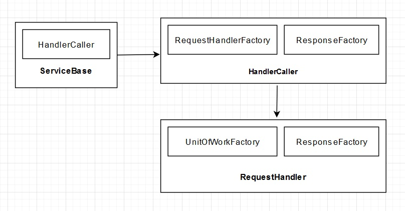

# dotnetcore_startup_with_efcore
This is startup project for dotnet core 6. Following features are ready - 
- Request Handler
- Unit Of Work pattern with Entity Framework Core.
- Repository 
- Logic


## Conceptual Model
Any request from a service (i.e., CoreSerivce) is handled by HandlerCaller. The HandlerCaller has the responsibility to process the request by finding a RequestHandler from the RequestHandlerFactory and response to the request from the ResponseFactory. 
Each Handler creates a unitOfWork from the UnitOfWorkFactory to further process the request and interact with the databse.



## How to populate database
 - Go to package manager console 
 - Set the src project as default
 - Run ``` Add-Migration ``` and provide a version name
 - Run ``` Update-Database ```
 
